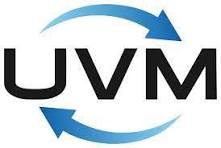

# Hi, I'm Sara 👋  
A software developer passionate about clean code, deep problem-solving, and mastering core technologies.

---

## 🚀 About Me
- 🔭 Currently in a **technology bootcamp**, focusing on **C** and **C++**  
- ♟️ Actively building a **multiplayer chess engine** in modern C++  
- 📚 Practicing and expanding skills in **data structures & algorithms**  
- 💬 Enjoy discussing **class design, algorithmic thinking, and performance-focused development**  
- 🤝 Open to interesting ideas, technical challenges, or meaningful collaborations   

📫 Reach me: [Email](mailto:sara.kovner@gmail.com) | [GitHub](https://github.com/SaraKovner)  

---

## 🧠 Languages & Technologies

  <!-- Languages -->
  
  
  <!-- Web -->
  
  
  <!-- Databases -->
  
  
  
  <!-- OS -->
  
  
  <!-- Tools -->
  

### Chip Design & Verification

  
  
  

---

## 🌟 Featured Projects

- 🧩 **Multiplayer Chess Engine**  
  Real-time multiplayer chess project written in modern C++, with custom networking and board state management.  
  🔗 [View on GitHub](https://github.com/SaraKovner/KungFuChess)

- 📚 **Data Structures Library**  
  Clean and well-documented implementations of core data structures in both C and C++.  
  Includes ARR, TREE, GRAPH, LL, and more — with new additions coming soon.  
  🔗 [View on GitHub](https://github.com/SaraKovner/DSA-Practice)

---

## 📊 GitHub Stats

---

🙌 Thanks for stopping by!  
If you liked one of my projects, feel free to leave a ⭐